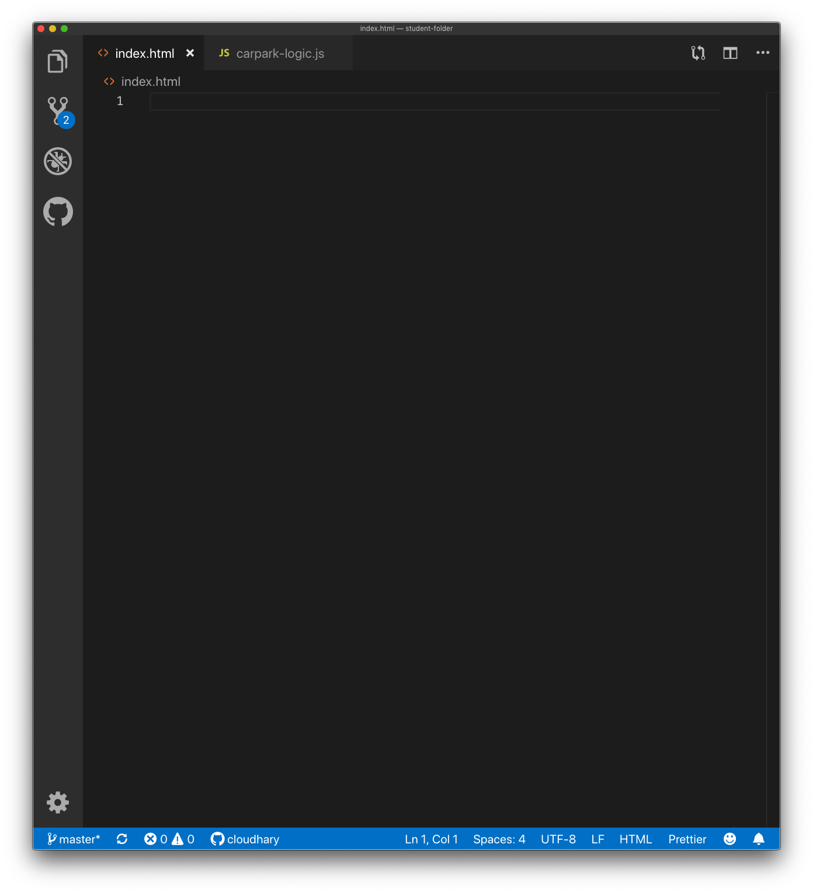
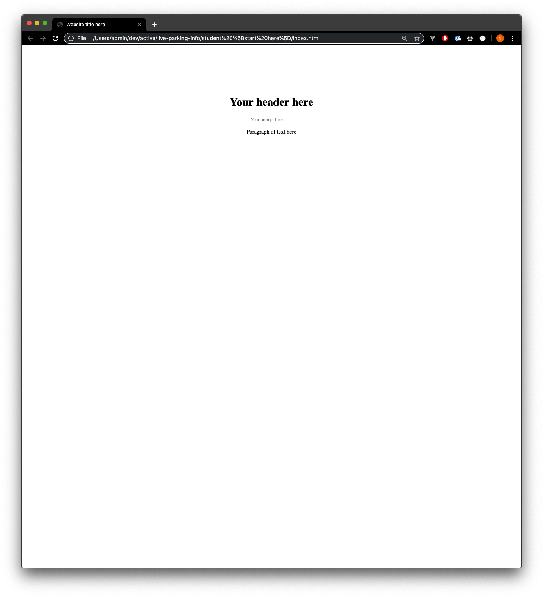
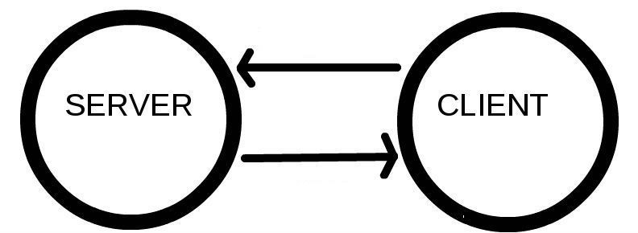

slidenumbers: true
<!-- Rendered using Deckset, simple theme -->

# Understanding Web Development

---

## Designed by [Open Government Products](https://docs.google.com/presentation/d/1elZPsJ_yze2bRcQ5DVNYjz2NbryRgMS8_caogi1JiEk/edit#slide=id.g4de465b1ea_0_34)

--- 

# Objectives

* Become familiar with the building blocks of websites
* Be unafraid of code and engineers

---

# What to expect

This is a **fast paced introduction** to web technologies that covers a lot of ground in a very short time. 

* We don't expect you to walk out as proficient coders, only with an appreciation of how websites work
* We encourage you to experiment and to ask questions

---

# Don't need to take photos! 

All material is available online at [github.com/opengovsg/live-parking-info](https://github.com/opengovsg/live-parking-info)

---

# What you're going to build


---

# Outline

1. Introduction to HTML - building the skeleton of our site
1. Introduction to Javascript - adding interactivity to our site
1. Introduction to APIs - fetching and displaying data on the site
1. Introduction to CSS - styling the site
1. Deploying the site on the cloud

---

# Where to find material on your computer

* Refer to `presentation/presentation.pdf` for the slides
* Go into `student [start here]/` folder to get started

---

# Setup

* Open `index.html` in **Visual Studio Code**  



---

# Setup

* Also open `index.html` in **Google Chrome**



---

# What is Visual Studio Code?

Visual Studio Code is a text editor program (similar to Notepad or Microsoft Word) specifically designed for editing source code of computer programs. Some helpful features that you'll experience as you code today include:

* Suggested autocompletion
* Code highlighting


---

# How does the web work?
Before writing code, let's provide a simplified view of what happens when you view a webpage in a web browser on your computer or phone.

---

# Clients and servers

* Clients are typically computing devices such as your computer, phone, or tablet that run browsers such as Firefox, Chrome, Safari, Edge, etc.
* Servers are computers that store webpages, sites, or apps. 

---

# What happens when I go to a website?

Your client device will download the webpage from the server and display it in the user's web browser.



For more information, go to [How the Web Works](https://developer.mozilla.org/en-US/docs/Learn/Getting_started_with_the_web/How_the_Web_works)


---

# Instructor Demo

- Go to [tech.gov.sg](https://www.tech.gov.sg/)
- Switch your internet connection off
- Right click on the webpage and select "Inspect"
- Type CMD + SHIFT + C or click on "Select element" icon
- Select the hero banner text
- Modify the content of that banner

--- 

# Websites are simply files

- Your website exists only on your client (your computer), so that change is only visible to you. 
- The fact that you were able to make changes shows that these are simply text files on your computer

---

# What does a webpage consist of?

| Term         | Metaphor | Function            |
|--------------|----------|---------------------|
| HTML         | Skeleton | Structure           |
| CSS | Skin / Clothes     | Styling, formatting |
| Javascript   | Brain    | Behaviour/actions   |

<!-- alternate analogy of a house, with structure, interior design, and smarts -->

---

# HTML

--- 

# What is HTML?

* Hyper Text Markup Language
* It describes the structure of a Web page and tells the browser how to display the content. 
* HTML elements are represented by tags
  * `<h1>` for header
  * `<p>` for paragraphs
  * `<input>` for user input

---

## <h1> What is Markup Language? </h1>

<p>A system for annotating a document in a way that is syntactically distinguishable from the text. </p>


---

[.code-highlight:3]
```html
<head>
  <script src="https://unpkg.com/axios/dist/axios.min.js"></script>
  <title>Website title here</title>
</head>
```


* `<title>` is the opening tag for the page's content and `</title>` is the closing tag
* Modify the website title

---


[.code-highlight:2,3,5]
```html
<body>
  <h1>Your header here</h1>
  <input id="locationInput" placeholder="Your prompt here" />

  <p id="carparkInfo">Paragraph of text here</p>
</body>
```
Change your header, placeholder, and paragraph text

---

[.code-highlight:2]
```html
<body>
  <h1>Your header here</h1>
  <input id="locationInput" placeholder="Your prompt here" />

  <p id="carparkInfo">Paragraph of text here</p>
</body>
```

* The `h1` tag makes the content inside become a **header**
* Try using `h2` instead and see the difference

<!-- Tell them about h1-6 tags -->

---

[.code-highlight:3]
```html
<body>
  <h1>Your header here</h1>
  <input id="locationInput" placeholder="Your prompt here" />

  <p id="carparkInfo">Paragraph of text here</p>
</body>
```

* `input` creates an input box
* `input` tags aren't designed to contain text or other elements, so there is _no_ corresponding closing tag

---

[.code-highlight:3]
```html
<body>
  <h1>Your header here</h1>
  <input id="locationInput" placeholder="Your prompt here" />

  <p id="carparkInfo">Paragraph of text here</p>
</body>
```

* HTML tags can have extra **attributes** given to them
* The `placeholder` **attribute** will specify the grey shadow text that prompts the user

---

[.code-highlight:5]
```html
<body>
  <h1>Your header here</h1>
  <input id="locationInput" placeholder="Your prompt here" />

  <p id="carparkInfo">Paragraph of text here</p>
</body>
```

* `<p>` tags stand for paragraph

---

# A short detour

Adding styles to your page!

[.code-highlight:1]
```html
<body style="background-color: lightskyblue">
  <h1>Your header here</h1>
  <input id="locationInput" placeholder="Your prompt here" />

  <p id="carparkInfo">Paragraph of text here</p>
</body>
```

What colors can I use? Find out [here](https://developer.mozilla.org/en-US/docs/Web/CSS/color_value)

---

# More color

[.code-highlight:5]
```html
<body style="background-color: lightskyblue">
  <h1>Your header here</h1>
  <input id="locationInput" placeholder="Your prompt here" />

  <p id="carparkInfo" style="color:red">Paragraph of text here</p>
</body>
```

---

# Recap

* Webpages all require HTML files in your browser
* HTML tells the browser what to display
* Using HTML tags and attributes

---

# What's next:

## Adding interaction to our page!

---

# Javascript

---
# What is Javascript?

* Programming language for the Web
* Update and change both HTML and CSS
* Calculate, manipulate and validate data

---

Move on to the section that starts with the `script` tag

---

```javascript
async function insertLocation(event) {
    alert("You typed something!");
}
```
`alert` creates a pop up on your screen. When does it run?

---

### The pop up runs when the user types in something to the text box. Lets review the existing code to understand why

---

# Current code

```javascript
var carparkLocation = document.getElementById("locationInput");

carparkLocation.addEventListener("keydown", insertLocation);
```

---

```javascript
var carparkLocation = document.getElementById("locationInput");
```

- `var` stands for variable
- a variable is a way to store information, like saving a word document
- We chose to name the variable `carparkLocation`
- `document` refers to the HTML that is loaded on the browser.

We're trying to connect to the HTML `<input>` tag by using `getElementById`

---

```javascript
carparkLocation.addEventListener("keydown", insertLocation);
```

- Whenever a `"keydown"` happens, go and `insertLocation` 
- `"keydown"` does not mean the down arrow key, it means that when ANY key on the keyboard goes down 

<!-- other events include include "mousedown", "mouseover", "keydown", "keyup", etc (more [here](https://developer.mozilla.org/en-US/docs/Web/Events)) -->
---

```javascript
async function insertLocation(event) {
    alert(1 + 2);
}
```
Javascript can do computation, unlike HTML

---

# Introducing functions

* Functions are like recipes - they're a way to group some instructions together

```javascript
function makeBreakfast() {
  makeMilo();
  makeKayaToast();
}
```

* `makeBreakfast` is the function name
* `{` is used to denote the start of function and `}` to denote end

---

# Introducing functions

* Functions are like recipes - they're a way to group some instructions together

```javascript
function makeBreakfast(miloPowder, kayaJam, bread) {
  makeMilo(miloPowder);
  makeKayaToast(kayaJam, bread);
}
```

* `miloPowder`, `kayaJam` and `bread` are the function inputs
* `(` denotes the start of function inputs and `)` denotes the end

---

# Why use functions?

```javascript
function makeBreakfast(miloPowder, kayaJam, bread) {
  makeMilo(miloPowder);
  makeKayaToast(kayaJam, bread);
}
```

* Functions are a way to remember code and make it easily repeated
* Monday morning, all you have to do is `makeBreakfast()`
* Tueday morning, once again, all you have to do is `makeBreakfast()`

---

# Functions

[.code-highlight:1,3]
```javascript
async function insertLocation(event) {
    alert("You typed something!");
}
```

- write the `function` keyword
- name it (in this example `insertLocation`)
- write your code between the `{` and `}` brackets

---

```javascript
async function insertLocation(event) {
  if (event.key === "Enter") {
      alert("You hit enter!");
  }
}
```
- we are using a conditional here, the `if` statement
- we use `===` to indicate that we're checking if they are equal because `=` was used to assign variables (see earlier)

---

```javascript
async function insertLocation(event) {
  if (event.key === "Enter") {
      alert(carparkLocation.value);
  }
}
```

`carparkLocation.value` gets the text that the user has typed into the input box

---

# Recap

* We have extracted information that the user has typed
* We can display that information back to the user

---

# How do we fetch the information? 

---

# What is an API call?

* Way for apps to communicate (over the internet)
* An API call is like a phone call to a wise person who has the answers to your questions
  * **"What time is it now?"**
  * **"Where are all the carparks in Singapore?"**
  * **"What is the current price of Bitcoin?"**

---

# Instructor Demo

- See how to make a credit card charge with Stripe
- See the latest weather on [data.gov.sg](https://data.gov.sg/dataset/realtime-weather-readings)

---

# How do we make an API call?

* We need the help of a request library
* A library is a set of functions that someone else has written
* Like using tools that a wise man created

---

# Why do we use APIs and libraries?

Less work for you. Why reinvent the wheel if there already is a good solution out there?

---
# Why do we use APIs and libraries?

Open source libraries are generally more secure and perform better than their proprietary equivalents

* Many people would have scrutinized the code to identify bugs, loopholes and vulnerabilities  and fix them
* Over time, these libraries will be "battle-tested" and prove that they can withstand load and usage

---

# Why do we use APIs and libraries?

Organizations and communities that build and maintain APIs and libraries have many resources to do them well

---

# Why do we use APIs and libraries?

Some information or actions can only be provided by certain people/organisations

* NEA collects weather data in Singapore and they host the data on data.gov.sg
* MAS provides authoritative exchange rates of SGD against other currencies 

---

## By using APIs and libraries, you can keep your app simple and focus on adding value

---

# Instructor Demo
- ensure that you have Python installed
- run `python image-recognition.py` to see the facial recognition software

---

[.code-highlight: 1-3]
```html
<head>
  <script src="https://unpkg.com/axios/dist/axios.min.js"></script>
</head>
```

* We'll be using the `axios` library to retrieve information
* Click on the link to see the code that we're using

---

```javascript
async function insertLocation(event) {
  if (event.key === "Enter") {
    var carparkResponse = await axios.get("https://n36b2gu773.execute-api.ap-southeast-1.amazonaws.com/beta?location=jurong")
  }
}
```
* Let's make the API call that will provide the data
* We `await` for the response from the API, cause that takes time
* It's like waiting for an order in a restaurant to be fulfilled

---

```javascript
async function insertLocation(event) {
  if (event.key === "Enter") {
    var carparkResponse = await axios.get("https://n36b2gu773.execute-api.ap-southeast-1.amazonaws.com/beta?location=jurong")
    alert(carparkResponse)
  }
}
```
* Let's display data fetched from the API

---

[.code-highlight:4]
```javascript
async function insertLocation(event) {
  if (event.key === "Enter") {
    var carparkResponse = await axios.get("https://n36b2gu773.execute-api.ap-southeast-1.amazonaws.com/beta?location=jurong")
    console.log(carparkResponse.data)
  }
}
```
- We see `[object Object]` in the pop up. That's not what we want to see.
- In order to see all the info, we need to use the "Console"
- Right click, select "Inspect", and click on the `Console` tab

---
[.code-highlight:3]
```javascript
async function insertLocation(event) {
  if (event.key === "Enter") {
    var carparkResponse = await axios.get("https://n36b2gu773.execute-api.ap-southeast-1.amazonaws.com/beta?location=" + carparkLocation.value)
    console.log(carparkResponse.data)
  }
}
```
Let's fetch data based on what the user types in

---

# Displaying info to user

* We need to be able to display the address that we get from the API call
* We can do that by using Javascript to:
  1. Find the `<p>` tag in the document
  1. Change the text inside
* We already gave the <p> tag the `carparkInfo` id in our HTML code

---

[.code-highlight:4-5]
```javascript
async function insertLocation(event) {
  if (event.key === "Enter") {
    var carparkResponse = await axios.get("https://n36b2gu773.execute-api.ap-southeast-1.amazonaws.com/beta?location=" + carparkLocation.value)
    var carpark = carparkResponse.data
    document.getElementById("carparkInfo").innerText = carpark.address
  }
}
```

- We change the text inside the <p> tag that has the `carparkInfo` id
- `getElementById` is case sensitive, so be precise with your casing and spelling
- Be precise with your spelling and casing - computers are quite unforgiving!


---

[.code-highlight:5]
```javascript
async function insertLocation(event) {
  if (event.key === "Enter") {
    var carparkResponse = await axios.get("https://n36b2gu773.execute-api.ap-southeast-1.amazonaws.com/beta?location=" + carparkLocation.value)
    var carpark = carparkResponse.data
    document.getElementById("carparkInfo").innerText = carpark.lots_available + " lots available at " + carpark.address
  }
}
```
Structure the text that you want the user to see by choosing between the different fields within

---

# Recap

* Javascript connects to HTML using `getElementById`
* A function is a bunch of code that's grouped together
* Calling a function runs the code in it
* Made API call to get nearest capark

---

# What's next?

* Content and logic is all done!
* Next - styling your site!

---

```css
body {
  background-image: url("background-image.png");
  background-size: cover;
  background-position: center;

  text-align: center;
  color: #F2F2F2;
  margin-top: 10%;
}
```

* Style the `body`
* Add each line one at a time and see the change

---

`carpark-style.css`

```css
h1 {
  font-size: 64px;
}

```

Style the `h1`

---

```css
input {
  font-size: 20px;

  width: 70%;
  padding: 12px 20px;
  margin-bottom: 30px;
  border-radius: 4px;
}
```

Style the `input` search box

---

```css
@import url('https://fonts.googleapis.com/css?family=Mandali');

body {
  background-image: url("background-image.png");
  background-size: cover;
  background-position: center;

  text-align: center;
  color: #F2F2F2;
  margin-top: 10%;
  font-family: "Mandali";
}

```

Import a font package from fonts.google.com

---

```css
@media only screen  
  and (max-device-width: 480px) {

  input {
    font-size: 32px;
    width: 95%;
  }
}
```

`@media` query: checking for screen size and then defining a specific style for the element

---

## Mobile responsiveness is not hard to do

---

# Recap

* Use CSS Selectors to style the `body`, `h1`, and `input`
* Use `@media` queries to set style for mobile devices

---


| Term         | Metaphor | Function            |
|--------------|----------|---------------------|
| HTML         | Skeleton | Structure           |
| CSS          | Skin / Clothes     | Styling, formatting |
| Javascript   | Brain    | Behaviour/actions   |

---

# Next Step!

* Deploying your app to the internet
* Up till now, your website has only been accessible on your computer
* We will now deploy it to the cloud so everyone can see and use it!

---

# Deployment

1. Go to [netlify.com/drop](https://app.netlify.com/drop)
1. Drag and drop the app folder on to the site.
1. Wait for it to process your data
1. Voila! Your site has been hosted!

---

## Cloud deployments do not need to be hard or expensive

---

# Recap

1. What a website consists of
1. HTML + Javascript + CSS
1. API calls - communication over the internet
1. Deploying websites to the cloud

---

# That's all folks!

## Any questions?

---

# Challenge Mode

If you're done and would like a little more of a challenge, try doing these:

- Change the background to another image
- Loading information takes time. Is there any way we can give the user visual feedback while they're waiting?
- Can we show additional information for the nearest carpark? Can we display an icon based on carpark type?
- Can we show the three nearest carparks instead of only one?
